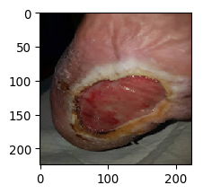
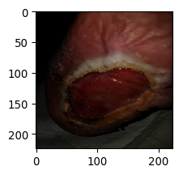
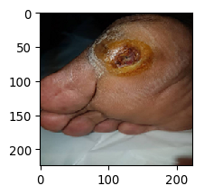
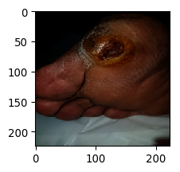
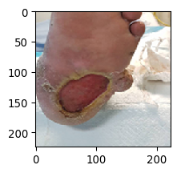
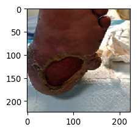
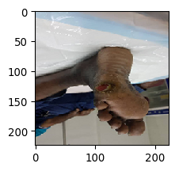
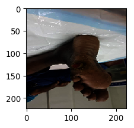

# Image Segmentation for wound Database - Implementation using Keras segmentation Library using Mobilenet, UNET

Implementation of image segmentation using Keras segmentation library

Link to Keras segmentation library = https://github.com/divamgupta/image-segmentation-keras

# Image segmentation will be done on Control dataset and Illumination variant Dataset

Control wound dataset = 200
Illumination wound dataset = 200

The dataset were augmented using <a href="https://github.com/mdbloice/Augmentor">Augmentor library</a> and <a href="https://github.com/aleju/imgaug">Imgaug library</a> for illumination and other augment.

The input image size were set to = 224x224

Example of the Dataset :

Controlled Image            |  Illumination Image
:-------------------------:|:-------------------------:
  |  
  |  
  |  
  |  

Example of Output segmentation :

Controlled             |  Illumination 
:-------------------------:|:-------------------------:
  |  
  |  

# Result on the image segmentation based on IoU

Controlled             |  Illumination 
:-------------------------:|:-------------------------:
frequency_weighted_IU: 0.865  |  frequency_weighted_IU: 0.862
mean_IU: 0.811  |  mean_IU: 0.806
class_wise_IU: array([0.912, 0.709])  |  class_wise_IU: array([0.913, 0.699])

# Reference
* https://github.com/divamgupta/image-segmentation-keras
* https://github.com/mdbloice/Augmentor
* https://github.com/aleju/imgaug
* http://www.medetec.co.uk/files/medetec-image-databases.html
